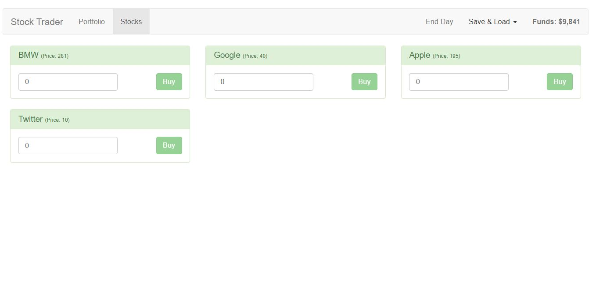

# vue-cli

> A stock trading application built using Vue.js. 
### Uses `vue-router`, `vue-resource` and `vuex state management`.




## Build Setup

``` bash
# install dependencies
npm install

# serve with hot reload at localhost:8080
npm run dev

# build for production with minification
npm run build
```


